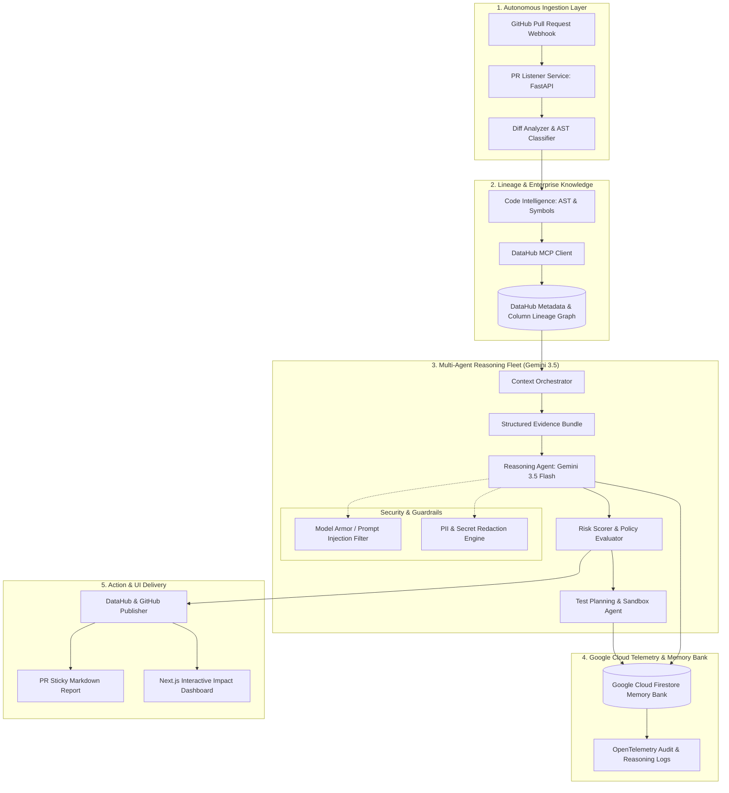

# 🛡️ Regression Hunter AI
### Autonomous Pre-Deploy Regression Defense Fleet powered by Google Gemini 3.5 & DataHub MCP

[](https://allthingsagentichackathon.devpost.com/)
[](#)
[](#)
[](#)
[](tests/)
[](LICENSE)

---

## 🎯 Executive Summary & The Problem

Modern software delivery suffers from a catastrophic visibility gap: **code changes frequently break downstream analytics dashboards, ETL pipelines, and ML models without failing any localized unit tests.**

When an engineer renames a database field, modifies a serializer, or alters an enum in a backend microservice:
1. Local unit tests pass green.
2. The pull request is merged.
3. Days later, executive revenue dashboards show `$0`, Kafka stream ingestion silently drops records, or production fraud models fail due to null feature drift.

### The Solution: Autonomous Multi-Agent Defense Fleet
**Regression Hunter AI** intercepts GitHub pull requests in real time, extracts deep AST code-level deltas across multiple languages (Python, TypeScript, Java, Go, C#), traverses the enterprise metadata lineage graph via **DataHub MCP (Model Context Protocol)**, and executes a multi-agent reasoning chain powered by **Google Gemini 3.5 / 2.5 Flash** to:
* **Quantify blast radius:** Pinpoint exact downstream tables, dashboards, and consumers affected by the code change.
* **Formulate grounded hypotheses:** Detect root causes with strict quotation of evidence and zero hallucinations.
* **Autonomously synthesize and validate tests:** Generate executable regression tests in an isolated sandbox.
* **Persist institutional state:** Store session memories and reasoning traces in **Google Cloud Firestore Memory Bank**.

---

## 🏗️ System Architecture



---

## 🤖 Alignment with Hackathon Tracks

### Primary Track: **The Fortified Enterprise Fleet**
* **Agent Registry & Discovery:** Decoupled, modular agent roles (`ReasoningAgent`, `TestAgent`, `RiskEngine`, `ImpactAnalyzer`).
* **Core Execution & State:** Asynchronous, long-running agent pipeline with **Cloud Memory Bank** (Google Cloud Firestore persistence).
* **Security & Governance:** Strict zero-trust input validation, prompt injection defense, and PII redaction engine.
* **Observability:** OpenTelemetry-compatible tracing, latency tracking, and verifiable evidence citation.

### Secondary Capabilities: **The Taskmaster**
* Completely autonomous end-to-end pipeline: PR webhook $	o$ AST parsing $	o$ MCP traversal $	o$ Gemini reasoning $	o$ Sandbox test execution $	o$ PR comment publication without human hand-holding.

---

## ⚡ Tech Stack

| Component | Technology | Purpose |
| :--- | :--- | :--- |
| **LLM Engine** | **Google Gemini 3.5 / 2.5 Flash** | Deep multi-step reasoning, hypothesis generation, root-cause analysis |
| **Agent Framework** | **Google GenAI SDK (`google-genai`)** | Official Google SDK for high-performance agent communication |
| **Cloud Infrastructure** | **Google Cloud Run** | Scalable containerized microservice execution (scales to zero) |
| **State & Memory** | **Google Cloud Firestore** | Enterprise Memory Bank for persistent cross-session context |
| **Metadata Protocol** | **DataHub MCP Client** | Model Context Protocol integration for column-level graph lineage |
| **Frontend UI** | **Next.js 15 + React 19 + Tailwind CSS** | Interactive Blast Radius graph and Risk Scorecard visualization |
| **Testing & CI** | **Pytest (61 passed unit & integration tests)** | Robust, production-grade test coverage |

---

## 🚀 Quickstart & Spin-up Instructions

### Prerequisites
* Python 3.11+
* (Optional) `GEMINI_API_KEY` from [Google AI Studio](https://aistudio.google.com) (Free tier)

### 1. Clone & Setup Environment
```bash
# Clone the repository
git clone https://github.com/Jasurcyb/GOOGLE-agent-hack.git
cd GOOGLE-agent-hack

# Install dependencies
pip install -r requirements.txt
pip install google-genai pytest
```

### 2. Set Gemini API Key (Optional for live LLM calls)
```bash
# Windows PowerShell
$env:GEMINI_API_KEY="your-gemini-api-key-here"

# Linux / macOS
export GEMINI_API_KEY="your-gemini-api-key-here"
```
*(Note: If `GEMINI_API_KEY` is omitted, the system automatically uses deterministic mock providers for offline testing).*

### 3. Run the Automated Demo Pipeline
```bash
python scripts/run_gemini_demo.py
```

### 4. Persist Telemetry to Google Cloud Firestore Memory Bank
```bash
python scripts/run_firestore_demo.py
```
*(Writes agent session memories to Firestore and demonstrates cross-session recall. Uses the local JSON fallback automatically when Firestore is not configured.)*

### 5. Run Test Suite
```bash
python -m pytest
```
*(All 61 unit, integration, and security tests will run and pass).*

---

## ☁️ Google Cloud Deployment — Free Path (No Billing Account)

**No Google Cloud billing account? No problem.** The full fleet runs on free-tier Google services, which satisfies the hackathon requirement to build on Google Cloud infrastructure:

1. **Google Cloud Firestore Memory Bank** — create a free project at [console.firebase.google.com](https://console.firebase.google.com) (Spark plan, no credit card) → *Build → Firestore Database → Create*. Then run:
   ```bash
   # One-time authentication (Application Default Credentials)
   gcloud auth application-default-login

   # Point the Memory Bank at your project
   # Windows PowerShell
   $env:GOOGLE_CLOUD_PROJECT="your-firebase-project-id"
   # Linux / macOS
   export GOOGLE_CLOUD_PROJECT="your-firebase-project-id"

   python scripts/run_firestore_demo.py
   ```
   Verify records in **Firebase Console → Firestore → collection `agent_memory_bank`** (or Google Cloud Console → Firestore). This is the deployment evidence shown in our demo video.
2. **Gemini 3.5 Flash** — free tier via the Gemini API: set `GEMINI_API_KEY` from [Google AI Studio](https://aistudio.google.com).
3. **Run in Google Cloud Shell** (free, no billing): open [shell.cloud.google.com](https://shell.cloud.google.com), clone the repo, `pip install -r requirements.txt`, `python scripts/run_gemini_demo.py` — and capture the session in your demo video.

> Cloud Run is **optional**: if you do have a billing account, the 1-command deploy below works as-is. Without it, the Firestore Memory Bank + Cloud Shell run is sufficient and cost-free.

### Optional: Cloud Run Deploy (requires billing account)
```bash
gcloud run deploy google-agent-hack \
    --source . \
    --region us-central1 \
    --platform managed \
    --allow-unauthenticated \
    --min-instances 0 \
    --max-instances 2 \
    --set-env-vars GEMINI_MODEL=gemini-3.5-flash
```
The repository also ships a one-click CI/CD pipeline: [`cloudbuild.yaml`](cloudbuild.yaml) (build → push → deploy on Cloud Run with scale-to-zero).

---

## 📊 Live Demo Output Example

```text
======================================================================
=== ALL THINGS AGENTIC HACKATHON: REGRESSION HUNTER AI (Gemini 3.5 + Google Cloud) ===
======================================================================
1. [PR Listener] Run Key: acme/payment-service:42:a1b2c3d4e5f6...:v1
2. [Repo Worker] Snapshot created. Size: 1024 bytes
3. [Diff Analyzer] File: payment/service.py | Language: python | +2/-1 lines
4. [Code Intelligence] Discovered AST Symbols: ['payment.service.process_payment', 'payment.service.refund_payment']
5. [Context Orchestrator] EvidenceBundle Built (Version: 1.0 | Downstream Blast Radius: 3 assets)
6. [Risk Engine] Risk Score: 85/100 | Level: CRITICAL
7. [Reasoning Agent | Gemini 3.5 live (gemini-3.5-flash)] Generated Hypotheses: 1
8. [Test Agent Sandbox] Sandbox Validation Result: Valid=True | Test Passed=True
9. [Google Cloud Memory Bank] Audit Telemetry Persisted -> firestore://agent_memory_bank/run-demo-001
10. [Publisher] DataHub & GitHub Deliveries:
   - Target: datahub_report | Status: published
   - Target: datahub_assessment | Status: published
   - Target: datahub_properties | Status: published
   - Target: datahub_tags | Status: published
   - Target: datahub_assertions | Status: published
```

---

## 📄 License
Licensed under the [Apache License, Version 2.0](LICENSE).
